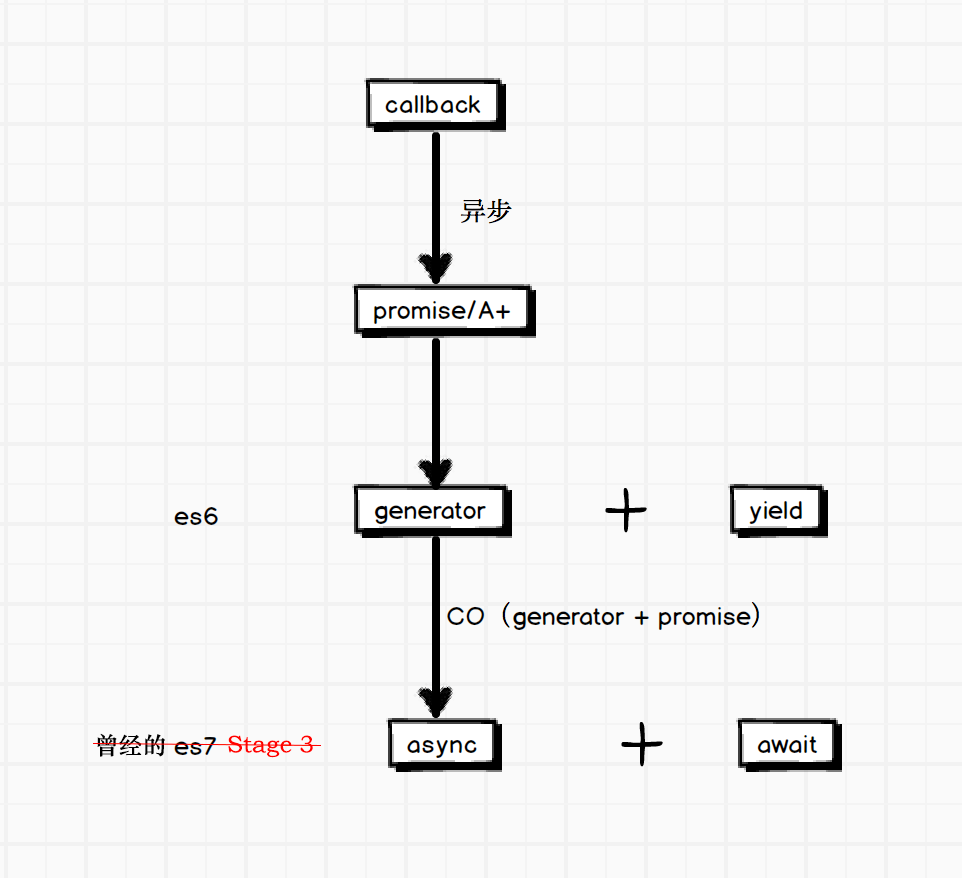

# JavaScript 异步编程思考

之前在 "前端之巅" 微信群中全程观看了 狼叔 分享的 ["深入浅出js（Node.js）异步流程控制"](https://github.com/i5ting/asynchronous-flow-control/blob/master/31.md)，把 js 异步流程控制的知识又回顾了下，感觉自己理解还有欠缺。趁此机会，又好好的研究了下，把之前的缺失补上来。

js 流程控制的演进过程，狼叔已经形象的画了出来，贴在这里供大家参考。



## Async/Await

逆向思维，为什么说 `Async/Await` 是终极解决方案。

如果没有 `Async/Await` ，该如何？

首先先看一个经典的读文件示例，用 `Async/Await` 实现。

```javascript
var fs = require('fs');

var readFile = function (fileName){
  return new Promise(function (resolve, reject){
    fs.readFile(fileName, function(error, data){
      if (error) reject(error);
      resolve(data);
    });
  });
};

var asyncReadFile = async function (){
  var f1 = await readFile('/etc/fstab');
  var f2 = await readFile('/etc/shells');
  console.log(f1.toString());
  console.log(f2.toString());
};
```

函数的执行和普通函数一致

```javascript
var result = asyncReadFile();
```

基本上和同步的写法没什么区别，还有更强大的实现吗？未来也许会有，但至少现在没有。

## Generator

若没有 `Async/Await` 该如何实现呢？

`Generator` 实现

```javascript
var gen = function* (){
  var f1 = yield readFile('/etc/fstab');
  var f2 = yield readFile('/etc/shells');
  console.log(f1.toString());
  console.log(f2.toString());
};
```

执行需要用 Generator 执行器。[co 函数库](https://github.com/tj/co) 是 TJ 大神发布的基于 ECMAScript 6 Generator 的异步控制解决方案，用于 Generator 函数的自动执行。执行方法如下：

```javascript
var co = require('co');
co(gen);
```

对比 `Async/Await`，两者写法都很优雅，但是还是有区别，主要体现在以下几点：

- 内置执行器。 Generator 函数的执行必须靠执行器，所以才有了 co 函数库，而 async 函数自带执行器。也就是说，async 函数的执行，与普通函数一模一样。
- 更好的语义。 async 和 await，比起星号和 yield，语义更清楚了。async 表示函数里有异步操作，await 表示紧跟在后面的表达式需要等待结果。
- 更广的适用性。 co 函数库约定，yield 命令后面只能是 Thunk 函数或 Promise 对象，而 async 函数的 await 命令后面，可以跟 Promise 对象和原始类型的值（数值、字符串和布尔值，但这时等同于同步操作）。
- 异常捕获。 async 函数的异常处理采用 try/catch 和 Promise 的错误处理，非常强大。

相比 `Generator`，`Async/Await` 更具普适性，用起来更为直观。

## Promise + Callback

关于 `Promise` 及 `Callback` 的异步实现方式，阮大师的文章 [Generator 函数的含义与用法](http://www.ruanyifeng.com/blog/2015/04/generator.html) 已经做了透彻的分析，就不再赘述。

## 其他

在进行方案选择时，还是那句老话，`适合的才是最好的`。考虑业务现状以及现有的技术栈，我们团队最终的选择方案就是 `co + promise`，但是将来呢？
