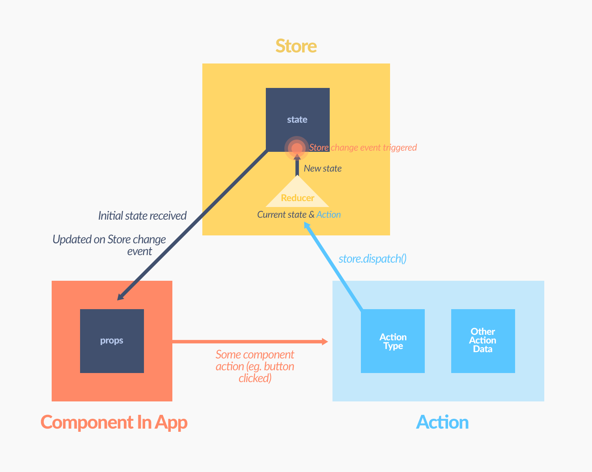

# Redux

Redux is a `predictable` `state container` for JavaScript apps.

Redux 是 JavaScript 状态容器，提供可预测化的状态管理。


## 动机

> **Managing complexity** is the most important technical topic in software development.

前端复杂性根本原因： `变化` + `异步`

React 试图在视图层禁止异步和直接操作 DOM 来解决这个问题。美中不足的是，React 依旧把处理 state 中数据的问题留给了你。Redux就是为了帮你解决这个问题。

Redux 试图让 state 的变化可预测。


## The Gist

The whole state of your app is stored in an object tree inside a single store.

The only way to change the state tree is to emit an action, an object describing what happened.

To specify how the actions transform the state tree, you write pure reducers.


## 三大原则

- **单一数据源 Single source of truth**

  整个应用的 state 被储存在一棵 object tree 中，并且这个 object tree 只存在于唯一一个 store 中。

- **state 只读 State is read-only**

  惟一改变 state 的方法就是触发 action，action 是一个用于描述已发生事件的普通对象。

  这样确保了视图和网络请求都不能直接修改 state，相反它们只能表达想要修改的意图。

- **使用纯函数来执行修改 Changes are made with pure functions**

  为了描述 action 如何改变 state tree ，你需要编写 reducers。

  Reducer 只是一些纯函数，它接收先前的 state 和 action，并返回新的 state。


## Action

Action 只是个普通的 JS Object，一定要有一个 type。

```javascript
{
  type: SEND_MESSAGE,
  payload: {
    text: 'Hello world'
  }
}
```

type 一般定义为常量，放在 ActionCreator 或额外的 actionTypes 文件中统一维护。

```javascript
export const ADD_TODO = 'ADD_TODO';
export const COMPLETE_TODO = 'COMPLETE_TODO';
export const SET_VISIBILITY_FILTER = 'SET_VISIBILITY_FILTER';
```

[Flux Standard Action](https://github.com/acdlite/flux-standard-action) 给出了推荐的 action 定义，包括 `type`、`payload`、`error`、`meta`。

Action 是把数据传到 store 的唯一手段，表达修改 state 的意图。它是 store 数据的唯一来源。一般通过 store.dispatch() 将 action 传到 store。

### Action Creator

> type ActionCreator = (...args: any) => Action \| AsyncAction

Action Creator 是一个创建 action 的纯函数。不要混淆 action 和 action creator 这两个概念。action 是一个信息的负载，而 action creator 是一个创建 action 的工厂。

传统的 flux 的 action creator 会创建 action 并 dispatch

```javascript
function sendMessage(text) {
  const action = {
    type: SEND_MESSAGE,
    payload: {
      text
    }
  };
  dispatch(action); // 注意，这里不是 Pure 的
}
```

Redux 中的 Action Creator 就是创建 action 的 Pure Function

```javascript
function sendMessage(text) {
  return {
    type: SEND_MESSAGE,
    payload: {
      text
    }
  };
}

// 实际的 dispatch action，先不管 dispatch 的来源
dispatch(sendMessage('Hello'));
```

作为纯函数还非常方便进行测试

```javascript
expect(sendMessage('Hello')).to.deep.equal({
    type: SEND_MESSAGE,
    payload: {
      text: 'Hello'
    }
});
```


## Reducer

reducer 函数提供了一种把 action 分发到状态修改器的机制。

reducer 是一个`纯函数`，接收旧的 state 和 action，返回新的 state。

> ( previousState, action ) => newState

Reducer 初始化阶段的入参是 `[undefined, {type: '@@redux/INIT'}]`，也就是说 Redux 会 dispatch `@@redux/INIT` action 來初始化 state。

之所以称作 reducer 是因为它将被传递给 `Array.prototype.reduce(reducer, ?initialValue)`方法。

需要谨记 reducer 一定要保持纯净。只要传入参数相同，返回计算得到的下一个 state 就一定相同。没有特殊情况、没有副作用，没有 API 请求、没有变量修改，单纯执行计算。永远不要在 reducer 里做这些操作：

- 修改传入参数；
- 执行有副作用的操作，如 API 请求和路由跳转；
- 调用非纯函数，如 Date.now() 或 Math.random()。

reducer 中不要修改 state，同时，在 default 情况下返回旧的 state。

注意每个 reducer 只负责管理全局 state 中它负责的一部分。每个 reducer 的 state 参数都不同，分别对应它管理的那部分 state 数据。

combineReducers() 所做的只是生成一个函数，这个函数来调用你的一系列 reducer，每个 reducer 根据它们的 key 来筛选出 state 中的一部分数据并处理，然后这个生成的函数再将所有 reducer 的结果合并成一个大的对象。


## Store

Action 描述 "发生了什么"，Reducer 根据 action 更新 state，Store 就是把它们联系到一起的对象。

Store 有以下职责：

- 维持应用的 state；
- `getState()` 返回当前 store 的 state；
- `dispatch(action)` 方法更新 state；
- `subscribe(listener)` 注册监听器;
- 通过 `subscribe(listener)` 返回的函数注销监听器。
- `replaceReducer(nextReducer)` 可用于热重载和代码分割。通常你不需要用到这个 API。

Redux 应用只有一个`单一的 store`。当需要拆分数据处理逻辑时，应该使用 `reducer 组合` 而不是创建多个 store。

Store 构建顺序

```javascript
reducers => 'combineReducers'
                    => rootReducer => 'createStore' (+ 'applyMiddleware')
                                                    |
                                                   ===> **Store**
```

往 createStore 传 Reducer 的过程就是给 Redux 绑定 action 处理函数（也就是 Reducer）的过程。

combineReducers 接收一个对象并返回一个函数，当 combineReducers 被调用时，它会去调用每个 Reducer，并把返回的每一块 state 重新组合成一个大 state 对象（也就是 Redux 中的 Store）。

combineReducers 间接构造了应用的 **_状态树_**。

### Store enhancer

> type StoreEnhancer = (next: StoreCreator) => StoreCreator

Store enhancer 是一个组合 store creator 的高阶函数，返回一个新的强化过的 store creator。这与 middleware 相似，它也允许你通过复合函数改变 store 接口。


## Store、Reducer、Action关联

- store 在这里代表的是数据模型，内部维护了一个state变量，用例描述应用的状态。store有两个核心方法，分别是 getState、dispatch。前者用来获取store的状态（state），后者用来修改store的状态。
- action 对行为（如用户行为）的抽象，在redux里是一个普通的js对象。redux对action的约定比较弱，除了一点，action必须有一个type字段来标识这个行为的类型。
- reducer 一个普通的函数，用来修改store的状态。传入两个参数 state、action。其中，state为当前的状态（可通过store.getState()获得），而action为当前触发的行为（通过store.dispatch(action)调用触发）。reducer(state, action) 返回的值，就是store最新的state值。


## 数据流

**严格的单向数据流** 是 Redux 架构的设计核心。

Redux 应用中数据的生命周期遵循下面 4 个步骤：

- 调用 store.dispatch(action)。
- store 调用传入的 reducer 函数。
- root reducer 把多个 reducer 的输出合并成唯一的 state 树。
- store 保存 root reducer 返回的 state 树。


## Redux 流转图




## Middleware

> dispatch => dispatch'

Middleware 用来延伸 dispatch 的功能。

使用 applyMiddleware 应用 Middleware。

```javascript
import { createStore, applyMiddleware } from 'redux';

const store = createStore(
  reducer,
  applyMiddleware(promise, thunk, observable)
);
// applyMiddleware 可以 decorate createStore
```

常用的 Middleware有以下几个

- **redux-thunk**

  让 Store 可以 dispatch Thunk

```javascript
function sendMessageAsync(message) {
  return dispatch => {
    setTimeout(() => {
      dispatch(sendMessage(message));
    }, 1000);
  };
}
```

- **redux-promise**

  让 Store 可以 dispatch Promise

```javascript
function sendMessageAsync(message) {
  return dispatch => {
      dispatch(new Promise((resolve, reject)) => {
        setTimeout(() => {
            resolve(sendMessage(message))
        }, 1000);
      });
  };
}
```

非同步的地方让 Action Creator 去做， Reducer 是完全同步的。

- **redux-actions**

  [Flux Standard Action](https://github.com/acdlite/flux-standard-action) 工具

```javascript
import { createAction, handleActions } from 'redux-actions';

// Action types;
export const INITIAL_OVER = 'INITIAL_OVER';

// Initial state
const initialState = null;

// reducer
const reducer = handleActions({
  [INITIAL_OVER]: (state, action) => {
    return action.payload;
  },
}, initialState);
export default reducer;

// action creators:
export const initialOver = createAction(INITIAL_OVER);

// async action creators: create async function as redux-thunk.
export function init() {
  return async (dispatch) => {
    const info = await fetch('/users/me');
    dispatch(initialOver(info));
  };
}
```


## React + Redux

Redux 支持 React、Angular、Ember、jQuery 甚至纯 JavaScript。

尽管如此，Redux 还是和 React 和 Deku 这类框架搭配起来用最好，因为这类框架允许你以 state 函数的形式来描述界面，Redux 通过 action 的形式来发起 state 变化。


`react-redux` 是 Redux 官方提供的 React 绑定库，提供 Provider 和 connect 两个支持工具。

### Provider

Provider 用来在 RootComponent 外再包一层，并把 Store 用 React context 向下传递。

```javascript
// 包在 Provider 才能 connect Store
<Provider store={store}>
  <MyRootComponent>
</Provider>
```

### connect

把特定的 `state 或者 action creator` 从 Context 里的 Store select 出來，并把他们当 props 向下传递。

示例一： 传递 state

```javascript
class MyComponent extends React.Component {
  render() {
    const { dispatch, user } = this.props;
    // connect 没给第二个参数时 dispatch 会将预设 props 传下来
    // ..
  }
}

export default connect(state => ({
  user: state.user
}))(MyComponent);
```

示例二： 传递 action creator

```javascript
function mapStateToProps(state) {
  return { user: state.user };
}

// 把 dispatch 变成 Handler 当成 Props 传下去
function mapDispatchToProps(dispatch) {
  return {
    // 可以用 bindActionCreators 把整个 action creator 的 Handler 传下去
    sendMessage: (msg) => { dispatch(sendMessage(msg)) }
  };
}

class MyComponent extends React.Component {
  render() {
    const { user, sendMessage } = this.props;
    // sendMessage 也会当 props 传下来
    // ..
  }
}

export default connect(mapStateToProps, mapDispatchToProps)(MyComponent);
```

关于 Provider/connect 的具体使用方法请参考 [官网文档](https://github.com/reactjs/react-redux/blob/master/docs/api.md#connectmapstatetoprops-mapdispatchtoprops-mergeprops-options)，或者 [中文翻译](http://cn.redux.js.org/docs/react-redux/api.html)。

## DevTools

详情请参考：

- <https://github.com/gaearon/redux-devtools>
- <https://github.com/zalmoxisus/redux-devtools-extension>

**安装**

[Chrome Extention](https://chrome.google.com/webstore/detail/redux-devtools/lmhkpmbekcpmknklioeibfkpmmfibljd)

**配置**

在程序源码中，将

```javascript
let store = createStore(reducer);
```

替换为

```javascript
let store = createStore(reducer, window.devToolsExtension && window.devToolsExtension());
```
