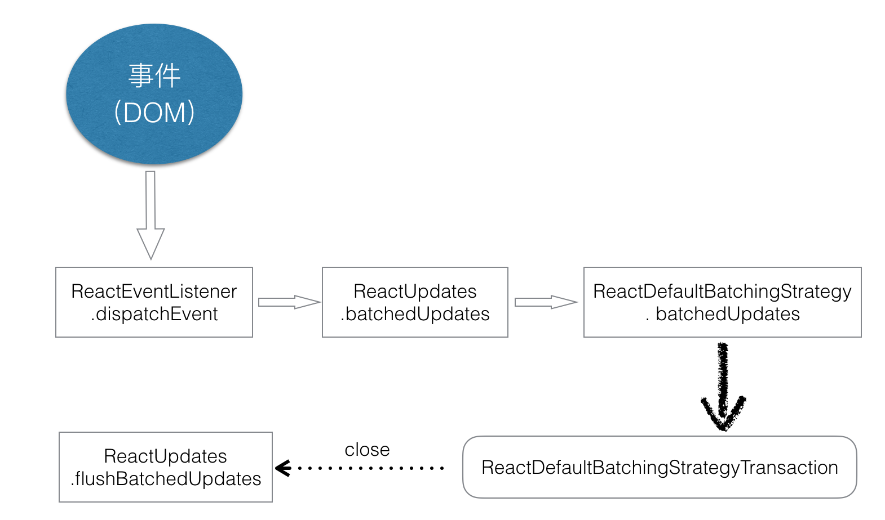

# React Transaction 机制

React 实现中，大量使用了 Transaction。本文试图对 Transaction 机制进行解析，不当之处，敬请指出。

## Transaction 机制

直接看源码（只保留关键代码）：

```javascript
// Transaction.js

/**
 * `Transaction` creates a black box that is able to wrap any method such that
 * certain invariants are maintained before and after the method is invoked
 * (Even if an exception is thrown while invoking the wrapped method). Whoever
 * instantiates a transaction can provide enforcers of the invariants at
 * creation time. The `Transaction` class itself will supply one additional
 * automatic invariant for you - the invariant that any transaction instance
 * should not be run while it is already being run. You would typically create a
 * single instance of a `Transaction` for reuse multiple times, that potentially
 * is used to wrap several different methods. Wrappers are extremely simple -
 * they only require implementing two methods.
 *
 * <pre>
 *                       wrappers (injected at creation time)
 *                                      +        +
 *                                      |        |
 *                    +-----------------|--------|--------------+
 *                    |                 v        |              |
 *                    |      +---------------+   |              |
 *                    |   +--|    wrapper1   |---|----+         |
 *                    |   |  +---------------+   v    |         |
 *                    |   |          +-------------+  |         |
 *                    |   |     +----|   wrapper2  |--------+   |
 *                    |   |     |    +-------------+  |     |   |
 *                    |   |     |                     |     |   |
 *                    |   v     v                     v     v   | wrapper
 *                    | +---+ +---+   +---------+   +---+ +---+ | invariants
 * perform(anyMethod) | |   | |   |   |         |   |   | |   | | maintained
 * +----------------->|-|---|-|---|-->|anyMethod|---|---|-|---|-|-------->
 *                    | |   | |   |   |         |   |   | |   | |
 *                    | |   | |   |   |         |   |   | |   | |
 *                    | |   | |   |   |         |   |   | |   | |
 *                    | +---+ +---+   +---------+   +---+ +---+ |
 *                    |  initialize                    close    |
 *                    +-----------------------------------------+
 * </pre>
 *
 * Use cases:
 * - Preserving the input selection ranges before/after reconciliation.
 *   Restoring selection even in the event of an unexpected error.
 * - Deactivating events while rearranging the DOM, preventing blurs/focuses,
 *   while guaranteeing that afterwards, the event system is reactivated.
 * - Flushing a queue of collected DOM mutations to the main UI thread after a
 *   reconciliation takes place in a worker thread.
 * - Invoking any collected `componentDidUpdate` callbacks after rendering new
 *   content.
 * - (Future use case): Wrapping particular flushes of the `ReactWorker` queue
 *   to preserve the `scrollTop` (an automatic scroll aware DOM).
 * - (Future use case): Layout calculations before and after DOM updates.
 *
 * Transactional plugin API:
 * - A module that has an `initialize` method that returns any precomputation.
 * - and a `close` method that accepts the precomputation. `close` is invoked
 *   when the wrapped process is completed, or has failed.
 *
 * @param {Array<TransactionalWrapper>} transactionWrapper Wrapper modules
 * that implement `initialize` and `close`.
 * @return {Transaction} Single transaction for reuse in thread.
 *
 * @class Transaction
 */
var Mixin = {
  /**
   * Sets up this instance so that it is prepared for collecting metrics. Does
   * so such that this setup method may be used on an instance that is already
   * initialized, in a way that does not consume additional memory upon reuse.
   * That can be useful if you decide to make your subclass of this mixin a
   * "PooledClass".
   */
  reinitializeTransaction: function () {...},

  _isInTransaction: false,

  /**
   * @abstract
   * @return {Array<TransactionWrapper>} Array of transaction wrappers.
   */
  getTransactionWrappers: null,

  isInTransaction: function () {
    return !!this._isInTransaction;
  },

  /**
   * Executes the function within a safety window. Use this for the top level
   * methods that result in large amounts of computation/mutations that would
   * need to be safety checked. The optional arguments helps prevent the need
   * to bind in many cases.
   *
   * @param {function} method Member of scope to call.
   * @param {Object} scope Scope to invoke from.
   * @param {Object?=} a Argument to pass to the method.
   * @param {Object?=} b Argument to pass to the method.
   * @param {Object?=} c Argument to pass to the method.
   * @param {Object?=} d Argument to pass to the method.
   * @param {Object?=} e Argument to pass to the method.
   * @param {Object?=} f Argument to pass to the method.
   *
   * @return {*} Return value from `method`.
   */
  perform: function (method, scope, a, b, c, d, e, f) {
    // --- 校验
    try {
      this._isInTransaction = true;
      // Catching errors makes debugging more difficult, so we start with
      // errorThrown set to true before setting it to false after calling
      // close -- if it's still set to true in the finally block, it means
      // one of these calls threw.
      errorThrown = true;
      this.initializeAll(0); // --- initialize
      ret = method.call(scope, a, b, c, d, e, f);
      errorThrown = false;
    } finally {
      try {
        if (errorThrown) {
          // If `method` throws, prefer to show that stack trace over any thrown
          // by invoking `closeAll`.
          try {
            this.closeAll(0);
          } catch (err) {}
        } else {
          // Since `method` didn't throw, we don't want to silence the exception
          // here.
          this.closeAll(0); // --- close
        }
      } finally {
        this._isInTransaction = false;
      }
    }
    return ret;
  },

  initializeAll: function (startIndex) {...},

  /**
   * Invokes each of `this.transactionWrappers.close[i]` functions, passing into
   * them the respective return values of `this.transactionWrappers.init[i]`
   * (`close`rs that correspond to initializers that failed will not be
   * invoked).
   */
  closeAll: function (startIndex) {...}
};

var Transaction = {

  Mixin: Mixin,

  /**
   * Token to look for to determine if an error occurred.
   */
  OBSERVED_ERROR: {}

};
```

通过示意图和源码可以看出，Transaction 将待执行的 method 使用 wrapper 封装起来，执行时调用其暴露的 perform 方法即可。perform 方法中用 initialize 和 close 方法将 method wrapper 起来，而且 initializeAll 和 closeAll 意味着支持多个 wrapper 的叠加。

## Transaction 实例化

[React 源码剖析系列 － 解密 setState](https://zhuanlan.zhihu.com/p/20328570?refer=purerender) 一文中详细解析了 setState 的实现过程，特别提到了 batchedUpdates 方法。Transaction 就是 batchedUpdates 实际的执行单元。

ReactUpdates 中 batchedUpdates 的源码如下：

```javascript
function batchedUpdates(callback, a, b, c, d, e) {
  ensureInjected();
  batchingStrategy.batchedUpdates(callback, a, b, c, d, e);
}
```

这里 batchingStrategy 是 ReactDefaultBatchingStrategy 的实例，其实例化过程稍后再介绍，先到 ReactDefaultBatchingStrategy 里面看看 Transaction 是如何实例化的。

```javascript
var transaction = new ReactDefaultBatchingStrategyTransaction();

var ReactDefaultBatchingStrategy = {
  isBatchingUpdates: false,

  /**
   * Call the provided function in a context within which calls to `setState`
   * and friends are batched such that components aren't updated unnecessarily.
   */
  batchedUpdates: function (callback, a, b, c, d, e) {
    var alreadyBatchingUpdates = ReactDefaultBatchingStrategy.isBatchingUpdates;

    ReactDefaultBatchingStrategy.isBatchingUpdates = true;

    // The code is written this way to avoid extra allocations
    if (alreadyBatchingUpdates) {
      callback(a, b, c, d, e);
    } else {
      transaction.perform(callback, null, a, b, c, d, e);
    }
  }
};
```

ReactDefaultBatchingStrategyTransaction 又是何方神圣，继续看源码。

```javascript
var ReactUpdates = require('./ReactUpdates');
var Transaction = require('./Transaction');

var emptyFunction = require('fbjs/lib/emptyFunction');

var RESET_BATCHED_UPDATES = {
  initialize: emptyFunction,
  close: function () {
    ReactDefaultBatchingStrategy.isBatchingUpdates = false;
  }
};

var FLUSH_BATCHED_UPDATES = {
  initialize: emptyFunction,
  close: ReactUpdates.flushBatchedUpdates.bind(ReactUpdates)
};

var TRANSACTION_WRAPPERS = [FLUSH_BATCHED_UPDATES, RESET_BATCHED_UPDATES];

function ReactDefaultBatchingStrategyTransaction() {
  this.reinitializeTransaction();
}

_assign(ReactDefaultBatchingStrategyTransaction.prototype, Transaction.Mixin, {
  getTransactionWrappers: function () {
    return TRANSACTION_WRAPPERS;
  }
});
```

到这里才明白，ReactDefaultBatchingStrategyTransaction 实际上扩展了 Transaction 原型，并插入了两个 wrapper，RESET_BATCHED_UPDATES 和 FLUSH_BATCHED_UPDATES 看名字就知道是干什么了，不解释了。

至此，Transaction 实例化过程介绍完了。

## batchingStrategy 实例化

上一节提到 batchingStrategy 是 ReactDefaultBatchingStrategy 的实例，那到底是在什么时候进行实例化的呢？batchingStrategy 是 ReactUpdates 内部维护的变量，所以阅读源码。

```javascript
var ReactUpdatesInjection = {
  injectReconcileTransaction: function (ReconcileTransaction) {
    !ReconcileTransaction ? process.env.NODE_ENV !== 'production' ? invariant(false, 'ReactUpdates: must provide a reconcile transaction class') : _prodInvariant('126') : void 0;
    ReactUpdates.ReactReconcileTransaction = ReconcileTransaction;
  },

  injectBatchingStrategy: function (_batchingStrategy) {
    !_batchingStrategy ? process.env.NODE_ENV !== 'production' ? invariant(false, 'ReactUpdates: must provide a batching strategy') : _prodInvariant('127') : void 0;
    !(typeof _batchingStrategy.batchedUpdates === 'function') ? process.env.NODE_ENV !== 'production' ? invariant(false, 'ReactUpdates: must provide a batchedUpdates() function') : _prodInvariant('128') : void 0;
    !(typeof _batchingStrategy.isBatchingUpdates === 'boolean') ? process.env.NODE_ENV !== 'production' ? invariant(false, 'ReactUpdates: must provide an isBatchingUpdates boolean attribute') : _prodInvariant('129') : void 0;
    batchingStrategy = _batchingStrategy;
  }
};
```

答案呼之欲出，原来是注入的。再查查是从什么地方注入的，向上递归查找，最终得到其实例化过程如下：

```javascript
ReactDOM.js => ReactDefaultInjection.inject() =>

 ReactUpdatesInjection.injectReconcileTransaction(ReactReconcileTransaction)
 ReactUpdatesInjection.injectBatchingStrategy(ReactDefaultBatchingStrategy)
```

React 中注入是在 ReactDOM.js 中发起，又顺便研究了下 React Native 的源码，其实例化过程和 React 保持一致。

```javascript
ReactNative.js => ReactNativeDefaultInjection.inject() =>

 ReactUpdates.injection.injectReconcileTransaction(ReactNativeComponentEnvironment.ReactReconcileTransaction);
 ReactUpdates.injection.injectBatchingStrategy(ReactDefaultBatchingStrategy);
```

React 和 React Native 都是用 ReactDefaultBatchingStrategy 来实例化 batchingStrategy。

## React 事件响应流程

总结了下 React 事件响应的流程，如下图所示：


