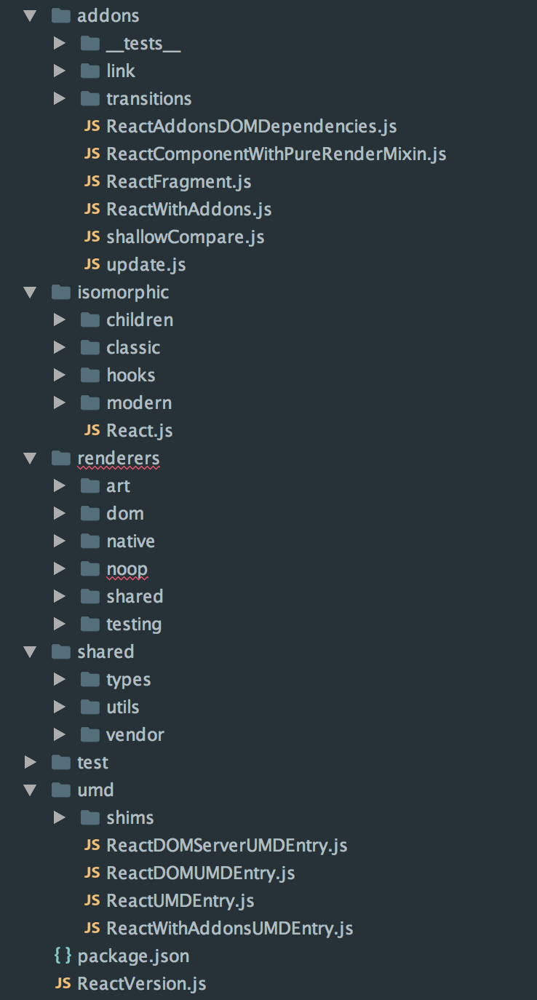

# React 源码概览一 （核心接口）

本来想写 React 源码分析，但读过之后发现 React 源码太多。没有精力、也没有时间保证能一一细读，还是写一篇指引性文章较为合适，尽量帮助那些想深入了解 React 机制的人迅速理清其源码脉络，找到想阅读的内容。

推荐两个库：[little-reactjs](https://github.com/purplebamboo/little-reactjs) 和 [react-lite](https://github.com/Lucifier129/react-lite)。这两个库都是精简版的 React 实现，能帮助你更好的理解 React 的设计思路。但对比之下发现还是 FB 原版的实现更为优雅，抽象层次以及考虑的细节也更为完善，读完绝对大有收获。

## 目录结构

从 github 上将 [react 源码](https://github.com/facebook/react) clone 下来，关键代码都放在 `src` 目录下，其它文件基本上都是示例、文档、或者编译相关的，暂时不用管。src 目录结构如下：



```javascript
├── addons/ // 插件
├── isomorphic/ // 抽象层次较高的一些文件、接口或实现，可用于多种环境。React 核心定义。
├── renderers/ // DOM、Native 等的渲染逻辑
├── shared/ // 共享的工具类
├── test/ // 测试
├── umd/ // 可以兼容多种环境 UMD 代码
├── ReactVersion.js // react 版本号
```

## 全局模块系统

了解了目录结构后，随便打开一个文件，有那么一瞬间是懵的。为啥？所有的 require 都没有用相对路径，难道所有的引用都是装在 node_modules 目录，但是找不到啊。而且引入的东西就在另一个目录导出的，为何直接 require 就能得到呢。这就引出了 `全局模块系统` 的概念。像 FB 这个级别的公司，必然存在一个巨大的工具库，所以内部根本就不能用相对路径，维护这个可不是轻松的活。关于全局模块系统的介绍，请参考文章：[探索 React 源码的全局模块系统](https://leozdgao.me/react-global-module-system/)。

全局模块系统使用了 `@providesModule`，然后在编译时将 require 变为相对路径，要想了解更多可以参考 [fbjs](https://github.com/facebook/fbjs/tree/master/packages/fbjs)。

正是因为引入了全局模块系统，所以最终编译出来的 js 文件才会平铺在 lib 目录下。

## React 接口

先看一下 React 对外暴露的接口有哪些，直接看 React.js 文件。

```javascript
var React = {

  // Modern

  Children: {
    map: ReactChildren.map,
    forEach: ReactChildren.forEach,
    count: ReactChildren.count,
    toArray: ReactChildren.toArray,
    only: onlyChild,
  },

  Component: ReactComponent,
  PureComponent: ReactPureComponent,

  createElement: createElement,
  cloneElement: cloneElement,
  isValidElement: ReactElement.isValidElement,

  // Classic

  PropTypes: ReactPropTypes,
  createClass: ReactClass.createClass,
  createFactory: createFactory,
  createMixin: function(mixin) {
    // Currently a noop. Will be used to validate and trace mixins.
    return mixin;
  },

  // This looks DOM specific but these are actually isomorphic helpers
  // since they are just generating DOM strings.
  DOM: ReactDOMFactories,

  version: ReactVersion,

  // Deprecated hook for JSX spread, don't use this for anything.
  __spread: __spread,
};
```

下面就其属性，一一进行分析。

### Children - ReactChildren

ReactChildren 提供了处理 this.props.children 的工具集.

```javascript
var ReactChildren = {
  forEach: forEachChildren,
  map: mapChildren,
  mapIntoWithKeyPrefixInternal: mapIntoWithKeyPrefixInternal,
  count: countChildren,
  toArray: toArray,
};
```

### Component - ReactComponent

当使用 ES6 类定义 React 组件时，Component 应当作为基类。

```javascript
function ReactComponent(props, context, updater) {
  this.props = props;
  this.context = context;
  this.refs = emptyObject;
  this.updater = updater || ReactNoopUpdateQueue;
}

ReactComponent.prototype.isReactComponent = {};
ReactComponent.prototype.setState = function(partialState, callback) {
  this.updater.enqueueSetState(this, partialState);
  if (callback) {
    this.updater.enqueueCallback(this, callback, 'setState');
  }
};
ReactComponent.prototype.forceUpdate = function(callback) {
  this.updater.enqueueForceUpdate(this);
  if (callback) {
    this.updater.enqueueCallback(this, callback, 'forceUpdate');
  }
};
```

### PureComponent - ReactPureComponent

PureComponent 继承自 ReactComponent，只不过在更新时会对 props 和 state 进行 shallowEqual。

### createElement, cloneElement, createFactory - ReactElement

这三个接口是为了生成 ReactElement。ReactElement 是个抽象的元素，可以对应 DOM 节点，也可以对应 Native 中的页面元素。

```javascript
var ReactElement = function(type, key, ref, self, source, owner, props) {
  var element = {
    // This tag allow us to uniquely identify this as a React Element
    $$typeof: REACT_ELEMENT_TYPE,

    // Built-in properties that belong on the element
    type: type,
    key: key,
    ref: ref,
    props: props,

    // Record the component responsible for creating this element.
    _owner: owner,
  };
  return element;
};

var REACT_ELEMENT_TYPE =
  (typeof Symbol === 'function' && Symbol.for && Symbol.for('react.element')) ||
  0xeac7;
```

### isValidElement - ReactElement.isValidElement

校验是否是 ReactElement，只需判断其 $$typeof 属性。

```javascript
ReactElement.isValidElement = function(object) {
  return (
    typeof object === 'object' &&
    object !== null &&
    object.$$typeof === REACT_ELEMENT_TYPE
  );
};
```

### PropTypes - ReactPropTypes

用于对 props 属性进行校验，可用的校验规则有：

```javascript
var ReactPropTypes = {
  array: createPrimitiveTypeChecker('array'),
  bool: createPrimitiveTypeChecker('boolean'),
  func: createPrimitiveTypeChecker('function'),
  number: createPrimitiveTypeChecker('number'),
  object: createPrimitiveTypeChecker('object'),
  string: createPrimitiveTypeChecker('string'),
  symbol: createPrimitiveTypeChecker('symbol'),

  any: createAnyTypeChecker(),
  arrayOf: createArrayOfTypeChecker,
  element: createElementTypeChecker(),
  instanceOf: createInstanceTypeChecker,
  node: createNodeChecker(),
  objectOf: createObjectOfTypeChecker,
  oneOf: createEnumTypeChecker,
  oneOfType: createUnionTypeChecker,
  shape: createShapeTypeChecker,
};
```

### createClass - ReactClass.createClass

根据指定对象，创建组件类。对象中应该至少包含 render 方法。

```javascript
var SpecPolicy = keyMirror({
  DEFINE_ONCE: null, // 仅定义一次
  DEFINE_MANY: null, // 可以定义多次
  OVERRIDE_BASE: null, // 重载基类
  DEFINE_MANY_MERGED: null, // 可以定义多次，但期望有返回值。
});

var ReactClassInterface = {
  mixins: SpecPolicy.DEFINE_MANY,
  statics: SpecPolicy.DEFINE_MANY,
  propTypes: SpecPolicy.DEFINE_MANY,
  contextTypes: SpecPolicy.DEFINE_MANY,
  childContextTypes: SpecPolicy.DEFINE_MANY,

  // ==== Definition methods ====
  getDefaultProps: SpecPolicy.DEFINE_MANY_MERGED,
  getInitialState: SpecPolicy.DEFINE_MANY_MERGED,
  getChildContext: SpecPolicy.DEFINE_MANY_MERGED,
  render: SpecPolicy.DEFINE_ONCE,

  // ==== Delegate methods ====
  componentWillMount: SpecPolicy.DEFINE_MANY,
  componentDidMount: SpecPolicy.DEFINE_MANY,
  componentWillReceiveProps: SpecPolicy.DEFINE_MANY,
  shouldComponentUpdate: SpecPolicy.DEFINE_ONCE,
  componentWillUpdate: SpecPolicy.DEFINE_MANY,
  componentDidUpdate: SpecPolicy.DEFINE_MANY,
  componentWillUnmount: SpecPolicy.DEFINE_MANY,

  // ==== Advanced methods ====
  updateComponent: SpecPolicy.OVERRIDE_BASE,
};

var ReactClassMixin = {
  replaceState: function(newState, callback) {
    this.updater.enqueueReplaceState(this, newState);
    if (callback) {
      this.updater.enqueueCallback(this, callback, 'replaceState');
    }
  },
  isMounted: function() {
    return this.updater.isMounted(this);
  },
};

var ReactClassComponent = function() {};
Object.assign(
  ReactClassComponent.prototype,
  ReactComponent.prototype,
  ReactClassMixin
);

var ReactClass = {
  createClass: function(spec) {
    var Constructor = function(props, context, updater) {
      // Wire up auto-binding
      if (this.__reactAutoBindPairs.length) {
        bindAutoBindMethods(this);
      }

      this.props = props;
      this.context = context;
      this.refs = emptyObject;
      this.updater = updater || ReactNoopUpdateQueue;

      this.state = null;
      var initialState = this.getInitialState ? this.getInitialState() : null;
      this.state = initialState;
    };
    Constructor.prototype = new ReactClassComponent();
    Constructor.prototype.constructor = Constructor;
    Constructor.prototype.__reactAutoBindPairs = [];

    mixSpecIntoComponent(Constructor, spec);

    // Initialize the defaultProps property after all mixins have been merged.
    if (Constructor.getDefaultProps) {
      Constructor.defaultProps = Constructor.getDefaultProps();
    }

    // Reduce time spent doing lookups by setting these on the prototype.
    for (var methodName in ReactClassInterface) {
      if (!Constructor.prototype[methodName]) {
        Constructor.prototype[methodName] = null;
      }
    }

    return Constructor;
  },
};
```

### DOM - ReactDOMFactories

根据支持的 HTML 标签创建 ReactDOMComponent 类的映射。

至此，React 的核心接口已经大体介绍完毕。发现东西比想象中的要多，所以决定还是分为多篇文章介绍，下一篇将介绍其渲染模块， [React 源码概览二 （渲染模块）](/react/react-source-code-render.html)
