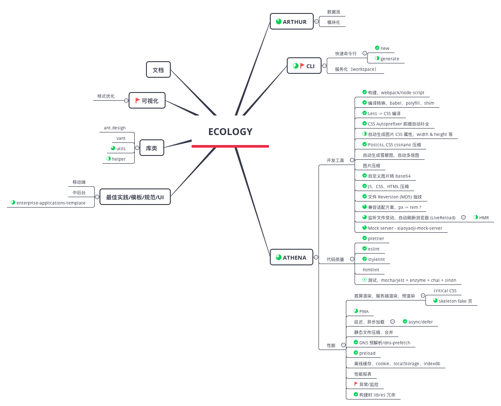

大约两年前，曾经尝试对前端架构进行认知，有所得。随着实践的累积，蓦然间，对整个前端体系有了不一样的理解，记于此。

## 旧时语

还记得那是 2015 年，Angular 如火如荼，React 方兴未艾，Vue 初露峥嵘，前端界一片欣欣向荣。

当时，和别人交流，不说组件化，那就是跟不上潮流。谈架构，必有组件化。

当时我的观点是这样的：

> 在大型软件中，组件化是一种共识，它一方面提高了开发效率，另一方面降低了维护成本。但是在 Web 前端这个领域，并没有很通用的组件模式，因为缺少一个大家都能认同的实现方式，所以很多框架/库都实现了自己的组件化方式。

对架构的理解是这样的：

> 架构的本质是什么？其实也是一种管理。通常我们所说的管理，都是指对于任务和人员的管理，而架构管的是机器和代码。比如说，机器的部署属于运维的物理架构，SOA属于服务架构，那么，前端的架构指什么呢？

> 前端领域中，存在三种共识，第一种定义是前端组件与组件间的交互共同构成了前端架构的主题。而另一种定义中，前端架构是指将前端研发领域中各种分散的技术元素集中在一起，并对常见的前端开发问题、不足、缺陷和需求，所提出的一种解决问题的方案。还有一种说法，前端架构大部分工作要解决的是如何用工具连接框架和规范的问题。这是一个工程问题，解决的是规范与框架的链接问题，而不是简单的前端源码构建。

> 以上定义都反映出当前前端领域所面临的几个问题，即：模块化、组件化、工程化。

## 今日言

这两年，经历了许多事，技术的、管理的。对架构一词竟越来越无感，更喜欢用解决方案/体系来阐述我们的产出，除了在对外交流时，不落俗套的用架构来做铺垫。

前段时间，为了给小伙伴们开阔思路，曾做过一次 [前端技术概览](./share-about-frontend.html) 的分享，其中

> 工程化 + 技术栈 => 架构（脚手架 +）

就是目前比较契合我们团队的一个总结。

**架构是抽象的，是现实业务的映射。如何转化为 `效能`，即 `落地`，将一些最佳实践具象化，是我们一直努力的方向，最终在 `脚手架 +`
中体现。**

陆陆续续，我们团队有了些不一样的东西：

- [athena](https://github.com/dx-groups/athena)

  基于 webpack 的应用开发工具，添加灵活的配置选项及周边支持。将工程化中的许多最佳实践融合在一起，将必要的内容固化，力求按照统一标准对外输出结果。

- [arthur](https://github.com/dx-groups/arthur)

  基于业务形成的一个业务框架。参考 dva，是对 redux 最佳实践的总结。

- [arthur-cli](https://github.com/dx-groups/arthur-cli)

  arthur 命令行工具，快速生成各种业务模板，追求速度和质量。

也可参考下图

已经很明晰了，我们期望输出一个完整的体系，也就是 **开发生态**

未来，我们还有非常多的事情要做，针对每个业务场景，都能有完整的解决方案。

目前，我们已经输出的解决方案有：

- 中后台场景
- 移动端 H5
- 官网

以后，在继续完善现有体系的同时，还要继续总结，把小程序、可视化、RN等都逐一落地。

这是一条很艰难的路，各种技术日新月异，需求场景也瞬息万变。我们能做的只能是像愚公一样，只顾风雨兼程，不去想未来是平坦还是泥泞。

> 一切，都在意料之中
