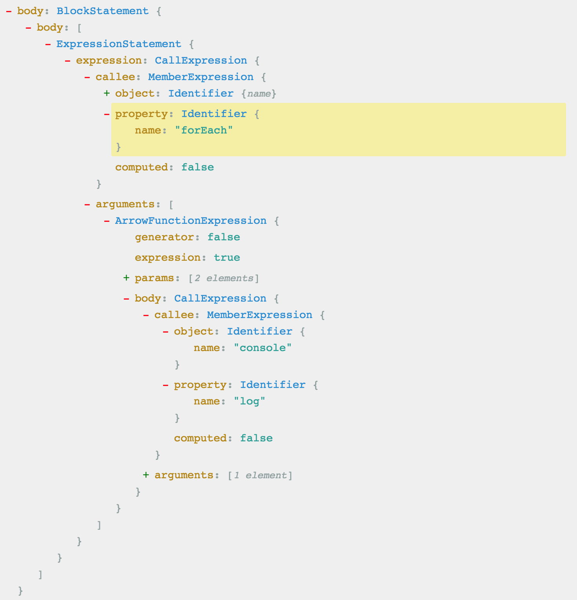
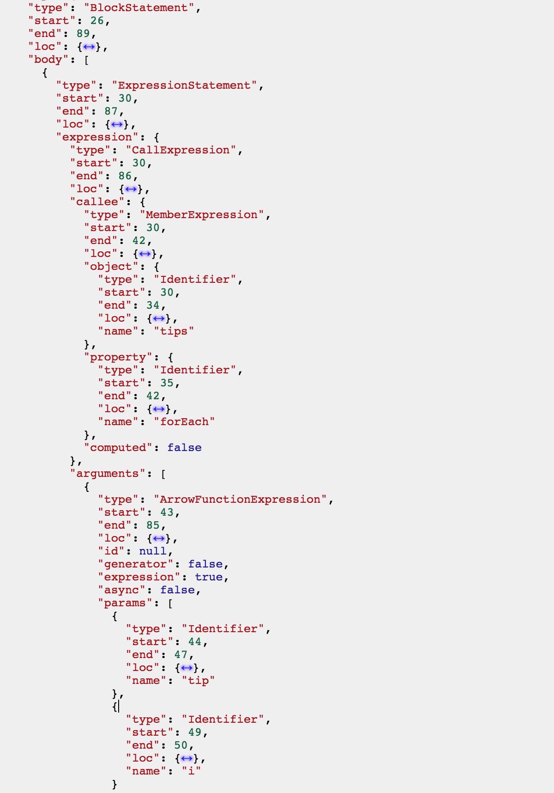

先谈一谈背景，最近在尝试输出小程序的开发体系，对 [Taro](https://taro.aotu.io/) 的编译方式产生浓厚的兴趣，趁机补一补 AST 的相关知识。

## 简介

AST（Abstract Syntax Tree，抽象语法树）在 [Wikipedia](https://en.wikipedia.org/wiki/Abstract_syntax_tree) 的定义如下：

> In computer science, an abstract syntax tree (AST), or just syntax tree, is a tree representation of the abstract syntactic structure of source code written in a programming language.

指的是：**源代码的抽象语法结构的树状表现形式**

## 编译原理

先回顾下编译原理的几大过程：

```bash

    **词法分析**   ===>   单词与记号、正则表达式、有限自动机、从正则表达式到有限自动机的转换、词法分析器的实现
        ││
    **语法分析**   ===>   上下文无关文法、递归下降分析、LR 分析、错误处理、语法分析器自动生成
        ││
    **语义分析**   ===>   类型系统、属性文法、语法制导翻译、符号表管理、抽象语法树、线性中间表示、图中间表示
        ││
  **中间代码生成**   ===>   变量地址分配、算术表达式翻译、布尔表达式翻译、数组、结构体和字符串的翻译、控制流的翻译、函数调用的翻译
        ││
**目标代码优化与生成**   ===>   目标体系结构、树匹配代码生成、基于动态规划的代码生成、寄存器分配、指令调度、控制流分析、数据流分析、死代码删除、常量传播、拷贝传播、静态单赋值形式

```

JavaScript 是一门解释型语言，但其在执行过程中仍然需要即时编译（JIT），其编译过程也遵循这些流程：

```bash

**分词／词法分析**   ===>   把字符串分解成有意义的代码块，这些代码块被称为词法单元
      ││
**解析／语法分析**   ===>   词法单元流（数组）转换成一个由元素逐级嵌套所组成的代表了程序语法结构的树，即 AST
      ││
  **代码生成**   ===>   将 AST 转换为可执行代码

```

总结一下：**通过 Parser 把代码转化为抽象语法树（AST），该树定义了代码的结构，通过对树的处理，能实现对代码的分析、优化等操作。**

## JavaScript 语法解析

在编译过程中，代码会被映射为 AST，那么就可以通过 AST 对代码进行分析、转换。像 webpack、babel、eslint 等涉及代码分析的工具类库，其背后都有 AST 的影子。

先看看 AST 长什么样，通过 [AST Explorer](https://astexplorer.net/) 可以实时解析和查看 JavaScript 的 AST。

```javascript
function printTips(tips) {
  tips.forEach((tip, i) => console.log(`Tip ${i}:` + tip));
}

// javascript code sample
$.ajax({
  type: 'POST',
  url: 'backend.php',
  data: "q="+myform.serialize(),
  success: function(data){
    // on success use return data here
  },
  error: function(xhr, type, exception) {
    // if ajax fails display error alert
    alert("ajax error response type "+type);
  }
});
```

对应的 AST 树部分截图如下



对应的 JSON 格式原始数据部分截图如下



AST 的格式每种 Parser 都有各自的标准，Esprima 的语法树结构文档 [Syntax Tree Format](https://esprima.readthedocs.io/en/4.0/syntax-tree-format.html)，下面是 type 的类型列表。

```javascript
type Expression = ThisExpression | Identifier | Literal |
    ArrayExpression | ObjectExpression | FunctionExpression | ArrowFunctionExpression | ClassExpression |
    TaggedTemplateExpression | MemberExpression | Super | MetaProperty |
    NewExpression | CallExpression | UpdateExpression | AwaitExpression | UnaryExpression |
    BinaryExpression | LogicalExpression | ConditionalExpression |
    YieldExpression | AssignmentExpression | SequenceExpression;
```

## JavaScript Parser

介绍完 AST 树，下面列举常用的 JavaScript Parser

- [Esprima](http://esprima.org/)
- [UglifyJS2](https://github.com/mishoo/UglifyJS2)
- [Traceur](https://github.com/google/traceur-compiler)
- [acorn](https://github.com/acornjs/acorn)
- [espree](https://github.com/eslint/espree) eslint
- [Shift](https://github.com/shapesecurity/shift-parser-js)

各个 parser 的速度对比可以参见 [Speed Comparison](http://esprima.org/test/compare.html)

## 应用

AST 的应用很广，从技术角度出发，所有涉及对代码处理的场景，AST 都有其用武之地。

编译器、代码压缩、代码混淆、代码优化，所有的 lint（不仅仅是 JavaScript），所有的打包构建工具及其插件，包括 webpack、rollup、parcel、browserify 等...

> 只有想不到，没有做不到，这才是应有的态度！

## 参考资料

- [AST Explorer](https://astexplorer.net/)
- [JavaScript 到底是解释型语言还是编译型语言?](https://segmentfault.com/a/1190000013126460)
- [Abstract Syntax Tree 抽象语法树简介](https://while4.com/2017/05/19/AST/)
