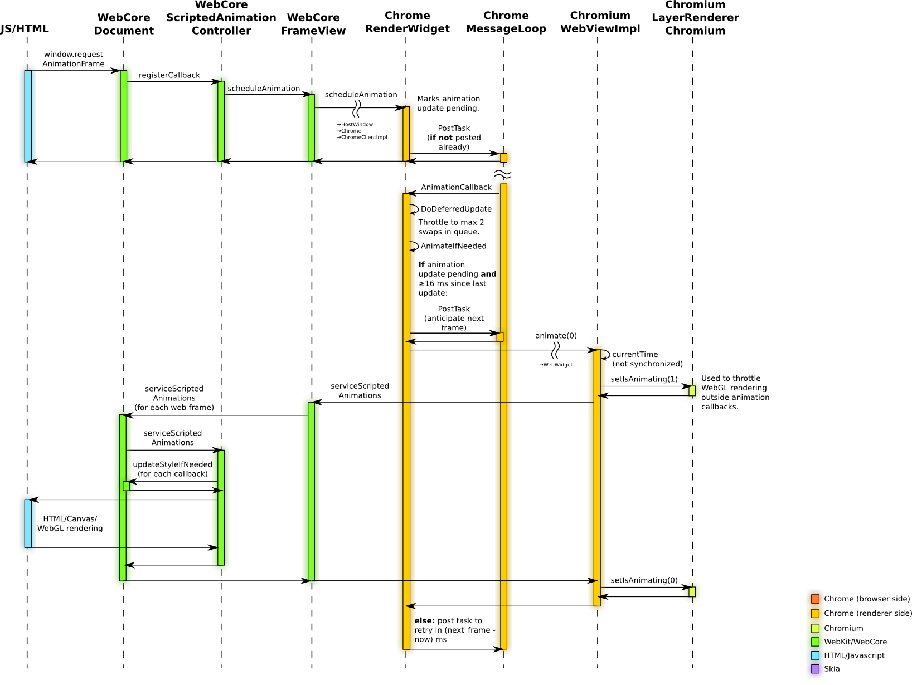

提到性能优化，有两个不得不提的 API：requestAnimationFrame 与 requestIdleCallback

## requestAnimationFrame

> The window.requestAnimationFrame() method tells the browser that you wish to perform an animation and requests that the browser call a specified function to update an animation before the next repaint. The method takes a callback as an argument to be invoked before the repaint.

requestAnimationFrame 是浏览器用于定时循环操作的一个接口，类似于 setInterval/setTimeout，主要用途是按帧对网页进行重绘。

显示器的刷新频率一般是 60Hz，即每秒最多只能重绘 60 次，相当于每 16.7ms 执行一次重绘。requestAnimationFrame 的基本思想就是与这个刷新频率保持同步，利用这个刷新频率进行页面重绘。

相较于 setInterval/setTimeout，requestAnimationFrame 有如下优点：

- 浏览器会有针对的优化，动画更流程
- 处于非活动 Tab 页的动画会暂停执行
- 更省电

### 语法

> window.requestAnimationFrame(callback);

requestAnimationFrame 使用一个回调函数 callback 作为参数，该函数在下次重新绘制动画时调用。

### 示例

```html
<!DOCTYPE html>
<head>
  <title>Script-based animation using requestAnimationFrame</title>
  <style>
  div {
    position: absolute;
    left: 10px;
    padding: 50px;
    background: crimson;
    color: white;
  }
</style>
</head>
<body>
  <button onclick="start()">Click me to start!</button>
  <button onclick="stop()">Click me to stop!</button>
  <div id="animated">Hello there.</div>

  <script>
  var requestId = 0;

  function animate(time) {
    document.getElementById("animated").style.left =
      (time - animationStartTime) % 2000 / 4 + "px";
    requestId = window.requestAnimationFrame(animate);
  }
  function start() {
    animationStartTime = window.performance.now();
    requestId = window.requestAnimationFrame(animate);
  }
  function stop() {
    if (requestId)
      window.cancelAnimationFrame(requestId);
    requestId = 0;
  }
  </script>
</body>
```

### 原理

[Rendering Architecture Diagrams](http://www.chromium.org/developers/design-documents/rendering-architecture-diagrams) 是 Chromium 官方的渲染架构介绍



上图是 requestAnimationFrame 的实现机制，想进一步了解也可参考 [浅析 requestAnimationFrame](http://taobaofed.org/blog/2017/03/02/thinking-in-request-animation-frame/)。

## requestIdleCallback

> The window.requestIdleCallback() method queues a function to be called during a browser's idle periods. This enables developers to perform background and low priority work on the main event loop, without impacting latency-critical events such as animation and input response. Functions are generally called in first-in-first-out order; however, callbacks which have a timeout specified may be called out-of-order if necessary in order to run them before the timeout elapses.

requestIdleCallback 会在某一帧结束后的空闲时间或者用户处于不活跃状态时，处理既定的工作，分别如下面两幅图所示：


### 语法

> window.requestIdleCallback(callback[, options])

callback 是即将被调用的函数的引用，函数会接收到一个名为 `deadline` 的参数，它具有如下属性 :

- timeRemaining() 返回当前帧还剩余的毫秒，且是动态更新的
- didTimeout 表示指定的时间是否过期

options 是可选的配置参数。具有如下属性：

- timeout 调用 callback 的最后期限

根据定义，只有当帧的运行时间小于 16.7ms 时，callback 才会触发，否则会一直等待下去，直到 `timeout` 后强制执行。

### 示例

```html
<!DOCTYPE html>
<head>
  <title>Scheduling background tasks using requestIdleCallback</title>
</head>
<body>
  <button onclick="start()">Click me to start!</button>
  <button onclick="stop()">Click me to stop!</button>
  <div id="piEstimate">Not started</div>
  
  <script>
  var requestId = 0;
  var pointsTotal = 0;
  var pointsInside = 0;

  function piStep() {
    var r = 10;
    var x = Math.random() * r * 2 - r;
    var y = Math.random() * r * 2 - r;
    return (Math.pow(x, 2) + Math.pow(y, 2) < Math.pow(r, 2))
  }
  function refinePi(deadline) {
    while (deadline.timeRemaining() > 0) {
      if (piStep())
        pointsInside++;
      pointsTotal++;
    }
    currentEstimate = (4 * pointsInside / pointsTotal);
    textElement = document.getElementById("piEstimate");
    textElement.innerHTML="Pi Estimate: " + currentEstimate;
    requestId = window.requestIdleCallback(refinePi);
  }
  function start() {
    requestId = window.requestIdleCallback(refinePi);
  }
  function stop() {
    if (requestId)
      window.cancelIdleCallback(requestId);
    requestId = 0;
  }
  </script>
</body>
```

## 兼容性

参考 [Can I Use...](https://caniuse.com/)

[requestanimationframe](https://caniuse.com/#search=requestAnimationFrame) 被主流的浏览器兼容，可以放心使用

[requestIdleCallback](https://caniuse.com/#search=requestIdleCallback) 目前仅被少数浏览器支持

## 参考资料

- [Timing control for script-based animations](https://www.w3.org/TR/animation-timing/)
- [Using requestAnimationFrame](https://css-tricks.com/using-requestanimationframe/)
- [Using requestIdleCallback](https://developers.google.com/web/updates/2015/08/using-requestidlecallback)
- [Cooperative Scheduling of Background Tasks](https://w3c.github.io/requestidlecallback/)
